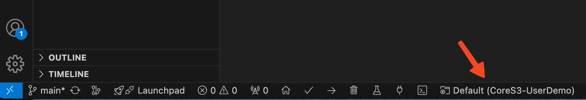
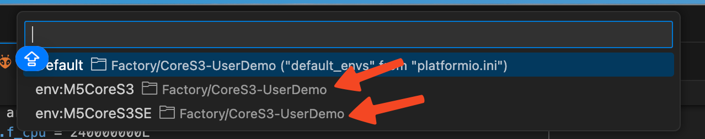

## M5CoreS3 & M5CoreS3SE User Demo

You may encounter the "cam_task canary ..." error, please consider replacing the
libesp32-camera.a(under pio package folder) to lib/libesp32-camera.a

### How to change board

1. Click PIO environment switch button
    
2. Select M5CoreS3 or M5CoreS3SE env
    

### Build info:
```bash
Processing esp32-s3-devkitc-1 (platform: espressif32; board: esp32-s3-devkitc-1; framework: arduino)
-------------------------------------------------------------------------------------------------------------------------------------------
Verbose mode can be enabled via `-v, --verbose` option
CONFIGURATION: https://docs.platformio.org/page/boards/espressif32/esp32-s3-devkitc-1.html
PLATFORM: Espressif 32 (6.1.0) > Espressif ESP32-S3-DevKitC-1-N8 (8 MB QD, No PSRAM)
HARDWARE: ESP32S3 240MHz, 320KB RAM, 8MB Flash
DEBUG: Current (esp-builtin) On-board (esp-builtin) External (cmsis-dap, esp-bridge, esp-prog, iot-bus-jtag, jlink, minimodule, olimex-arm-usb-ocd, olimex-arm-usb-ocd-h, olimex-arm-usb-tiny-h, olimex-jtag-tiny, tumpa)
PACKAGES: 
 - framework-arduinoespressif32 @ 3.20007.0 (2.0.7) 
 - tool-esptoolpy @ 1.40500.0 (4.5.0) 
 - toolchain-riscv32-esp @ 8.4.0+2021r2-patch5 
 - toolchain-xtensa-esp32s3 @ 8.4.0+2021r2-patch5
LDF: Library Dependency Finder -> https://bit.ly/configure-pio-ldf
LDF Modes: Finder ~ chain, Compatibility ~ soft
Found 45 compatible libraries
Scanning dependencies...
Dependency Graph
|-- M5GFX @ 0.1.6
|-- M5Unified @ 0.1.6
|-- lvgl @ 8.3.4
|-- Madgwick @ 1.2.0
|-- PageManager
|-- m5gfx_lvgl
|-- ESP32 BLE Arduino @ 2.0.0
|-- FFat @ 2.0.0
|-- Wire @ 2.0.0
|-- ResourceManager
|-- BMI270-Sensor-API
|-- BMM150-Sensor-API
|-- SD @ 2.0.0
|-- WiFi @ 2.0.0
|-- lv_anim_label
|-- lv_ext
Building in release mode
Retrieving maximum program size .pio/build/esp32-s3-devkitc-1/firmware.elf
Checking size .pio/build/esp32-s3-devkitc-1/firmware.elf
Advanced Memory Usage is available via "PlatformIO Home > Project Inspect"
RAM:   [===       ]  31.2% (used 102132 bytes from 327680 bytes)
Flash: [========= ]  92.1% (used 6759441 bytes from 7340032 bytes)
```